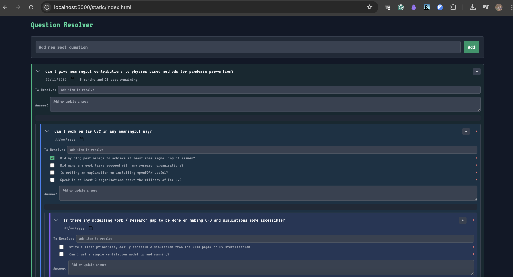

# Question Resolver
Have big, undefined goals? Here's a web application for managing nested questions, experiments, and their resolutions. 
I'm trying this out as an alternative to standard goal and task setting to help me deal with uncertainties better. 

I wrote about why I use this approach in [How do I achieve what I want](https://substack.com/home/post/p-162918993). 

STEPS
1. Write down a big question / uncertainty. 
2. That question is likely to have sub-questions. Using the '+' button, add those as well. 
3. Keep nesting those questions until you feel like they are sufficiently well defined for an experiment. 
4. Add those experiments in the 'To resolve' section. 
5. Tick off those experiments, and update your answers as you go along!



uilt with Flask. 

## Features

- Create and manage nested questions
- Track to-resolve items for each question
- Set time frames and track remaining time
- Add and update answers
- Modern, responsive UI with dark mode

## Setup

1. Clone the repository:
```bash
git clone https://github.com/casualPhysics/thought-tree.git
cd thought-tree
```

2. Create and activate a virtual environment:
```bash
python -m venv venv
source venv/bin/activate  # On Windows: venv\Scripts\activate
```

3. Install dependencies:
```bash
pip install -r requirements.txt
```

4. Run the application:
```bash
python app.py
```

The application will be available at `http://localhost:5000`

## Technologies Used

- Backend: Flask, SQLAlchemy
- Frontend: HTML, JavaScript, TailwindCSS
- Database: SQLite

## Project Structure

- `app.py`: Main Flask application
- `static/`: Frontend assets
  - `app.js`: Frontend JavaScript
  - `styles.css`: Custom styles
  - `index.html`: Main HTML template
- `instance/`: Database files (not tracked in git)
- `requirements.txt`: Python dependencies

## Usage

1. Add a root question using the form at the top of the page
2. Click "Add Child" on any question to create a sub-question
3. Use the "Edit" button to modify questions or add time frames
4. Add items to resolve under each question
5. Add or update answers for each question
6. Check off completed items in the "To Resolve" section

## Structure

The application uses:
- Flask backend with SQLAlchemy for database management
- SQLite database for data storage
- Modern frontend with Tailwind CSS
- Vanilla JavaScript for interactivity

## License

MIT License 